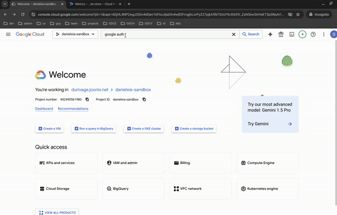

# Edge Parameter Store

- [Edge Parameter Store](#edge-parameter-store)
    * [Description](#description)
    * [Getting Started](#getting-started)
        + [Preparation](#preparation)
            - [Install required tools](#install-required-tools)
            - [Configure GCP OAuth Consent Screen](#configure-gcp-oauth-consent-screen)
            - [Parameter Store Domain Name](#parameter-store-domain-name)
            - [Prepare fully-qualified domain name of Parameter Store app](#prepare-fully-qualified-domain-name-of-parameter-store-app)
            - [TLS Certificate](#tls-certificate)
        + [Build Image](#build-image)
        + [Deploy to GCP](#deploy-to-gcp)
            - [System Diagram](#system-diagram)
            - [Initialize Terraform](#initialize-terraform)
            - [Terraform Configuration Variables](#terraform-configuration-variables)
            - [Deploy Parameter Store App](#deploy-parameter-store-app)
            - [Rerun Terraform After First Apply](#rerun-terraform-after-first-apply)
            - [Teardown](#teardown)
    * [Operate Parameter Store](#operate-parameter-store)
    * [Data Loading](#data-loading)
        + [Terraform](#terraform)
        + [How Does Data Loading Work?](#how-does-data-loading-work)
    * [Local Dev](#local-dev)
        + [Postgres Setup](#postgres-setup)
        + [Python Setup](#python-setup)
        + [Django Setup](#django-setup)
    * [Appendix](#appendix)
        + [Possible Errors](#possible-errors)
        + [Dev Hacks](#dev-hacks)
    * [Disclaimer](#disclaimer)

## Description

This repository gets you started in deploying Edge Parameter Store. GDCc at scale uses a source of truth for the
declartive intent during automated cluster provisioning. Edge Paramater Store enables users to manage the source of
truth through a management portal. Benefits of using edge parameter store

- SSO login via Google IAM
- Auditing - what happened when
- Schema - provides guardrails

## Getting Started

Go through all of the steps below to get started

- Preparation
- Build Image
- Deploy to GCP

### Preparation

This section outlines steps that is need to be done by the user in the for their respective actions:

- in the GCP portal. i.e to configure OAuth, create CloudSql..etc
- in preferred Domain/SSL provider. i.e Entrust,..etc
- in a terminal session, i.e to generate OpenSSL

#### Install required tools

* [Python 3.13](https://www.python.org/downloads/)
* [gcloud](https://cloud.google.com/sdk/docs/install)
* [terraform](https://developer.hashicorp.com/terraform/install)
* [docker](https://docs.docker.com/engine/install/)
* [psql client](https://docs.timescale.com/use-timescale/latest/integrations/query-admin/psql/)
  or [pgadmin](https://www.pgadmin.org/download/)

#### Configure GCP OAuth Consent Screen

1. Login [GCP Console](https://console.cloud.google.com) and select your target project
2. Go to **Google Auth Platform** and configure OAuth consent screen.  
   Configure the app as **External** and **In Production** app
   

#### Parameter Store Domain Name

#### Prepare fully-qualified domain name of Parameter Store app

Choose a fully qualified domain name for your application. The Terraform takes provides an opinionated configuration for
the utilization of your FQDN, creating a manged zone in the deployment project. This assumes you will create a delegated
zone in your application project to which an A-record for the EPS apps load balancer will be created. In doing so, it
wires the application up end-to-end. If this is not your desired configuration, you will need to modify the provided
Terraform [here](./terraform/dns.tf)

Set your selected fully-qualified domain name in [terraform.tfvars](terraform/terraform.tfvars):

```terraform
app_fqdn = "eps.cloud.corpdomain.com"
```

Add this name or a wild card name to the CSRF trusted list, which is variable *csrf_trusted_origins*
in [terraform.tfvars](terraform/terraform.tfvars) file. e.g.

```terraform
csrf_trusted_origins = ["eps.cloud.corpdomain.com"]
```

#### TLS Certificate

When using the provided Terraform, a TLS certificate is automatically generated and associated with the EPS load
balancer.

Providing and associating your own externally-managed TLS certificate is technically possible however the provided
example Terraform does not support this configuration and would require modification.

### Build Image

We will build a docker image and push to an Artifact Registry in the target deployment GCP project. Please make sure the
Artifact Registry is available and GCP account running the build script has sufficient permission to push image to it.

1. Clone this project and go to the project workspace

    ```bash
    git clone https://github.com/GDC-ConsumerEdge/parameter-store.git
    cd parameter-store
    ```

2. Update `terraform.tfvars`

3. build the docker image and push to Artifact Registry

    ```bash
    ./build.sh [VERSION] [APP]
    ```

* Both **VERSION** and **APP** are optional.  
  **VERSION** default to *0.1*, while **APP** default to *parameter-store*.
* The generated image is tagged as `${REPO_HOST}/${PROJECT_ID}/${REPO_FOLDER}/${APP}:v${VERSION}`  
  e.g. `gcr.io/test-proj-1234/parameter-store/parameter-store:v0.1`
* The `latest` tag is always attached to the most recently built image

### Deploy to GCP

Use Terraform to deploy parameter store infrastructure. Optionally deploy Parameter Store app with Terraform, though
this is not recommended in production.

<!---TODO: Update with instructions regarding Cloud Build.)--->

#### System Diagram


#### Initialize Terraform

For the first time to deploy parameter store, we need to initialize terraform state.

1. go to `deployment` folder

```bash
cd deployment
```

* If using local state file, e.g. for local development work, simply run

```bash
terraform init
```

* For better collaboration, most of the time we need to save the terraform state file to a shared place, e.g. a GCP
  bucket. To achieve this, we need to configure a GCP bucket as terraform backend.
    1. Create or using an existing GCS bucket. Make sure your current account has write permission to it.
    2. Create/Modify a terraform backend config file in [terraform/main.tf](./terraform/main.tf).
        ```terraform
        bucket = "my-bucket"
        prefix = "testing"
        ```
    3. initialize terraform with backend config
    ```bash
    terraform init -backend-config=env/testing.gcs.tfbackend
    ```

#### Terraform Configuration Variables

The full set of Terraform variables are defined in [variables.tf](terraform/variables.tf), though we will call out
notable items here.

`eps_project_id` is where the app (and nearly all) of its resources will be created. It is assumed this project already
exists.

`secrets_project_id` is the name of a Google Cloud Project where app-related secrets are to be configured. This may be
the same as the `eps_project_id` or yet another separate project.

`eps_image` is the full name and tag of the image to be deployed by Terraform to Cloud Run on its first invocation.

`terraform_principal` is the principal associated with the EPS Terraform deployment and is very likely a Google service
account.

`iap_audience` is the "audience" against which IAP JWT tokens are compared. This comes from the backend service
associated with your load balancer stack. This value is not known until Terraform is run the first time, so on its first
invocation, an empty string (`""`) is appropriate. This value takes the form of:

```bash
"/projects/${EPS project ID}/us-central1/backendServices/${EPS load balancer backend service number}"
```

You can find this number by running the following example:

```bash
gcloud compute backend-services describe eps-lb-backend-service \ 
  --region=us-central1 \
  --format="value(id)"
6252277272778218001
```

`superusers` is an array of users that will automatically receive EPS "superuser" permissions upon first login. This may
be omitted, in which case superusers will need to be configured manually or at all. EPS should have at
least 1 superuser. Because EPS uses IAP its identities (usernames) are email address configured in Google Identity. EPS
uses the username portion of the email address as its username. Simply drop the `@mycorp.com`.

`eps_allowed_accessors` is an array of IAM principals that will be granted Cloud Run invoker and IAP accessor
permissions. This does not grant in-app permissions but merely allows these identities web access through IAP and into
Cloud Run. This is probably a group of users the membership of which is managed externally to Terraform.

```terraform
environment_name    = "dev"
eps_project_id      = "example-eps"
secrets_project_id  = "example-eps"
eps_image           = "us-docker.pkg.dev/example-eps/hsp/parameter_store:v11"
terraform_principal = "serviceAccount:terraform@example-eps.iam.gserviceaccount.com"
app_fqdn            = "example.eps.example.net"
csrf_trusted_origins = ["localhost"]
iap_audience        = "/projects/22368248810/us-central1/backendServices/6252277272778218001"
superusers = ["example", "user"]
eps_allowed_accessors = ["group:eps@example.net"]
```

#### Deploy Parameter Store App

Use `terraform plan` to check the deployment.

```bash
terraform plan
```

Use `terraform apply` to deploy the app.

```bash
terraform apply
```

#### Rerun Terraform After First Apply

The IAP audience is not known until after the first run due to unfortunate cycles in the Terraform dependency graph.

Take the output value of `jwt_audence` and set as the variable `iap_audience`. It should look something like:

```
/projects/22368248810/us-central1/backendServices/6252277272778218001
```

When done, rerun `terraform apply`.

#### Teardown

```bash
terrform destroy
```

This command will tear down all the GCP resources provisioned by Terraform.  
Manual created resource requires manual deletion, including

## Operate Parameter Store

* After initial deployment, there is no user configuration for EPS if Terraform `superusers` variable was set
* All the following users will be assigned with minimum permissions, i.e. they can just log in system but not do
  anything else
* The superuser will be responsible to assign permission to users. But users must log in **at least once** so that the
  superuser can see them in the system.

## Data Loading

EPS can support data loading while running in Cloud SQL. Terraform sets up EPS infrastructure to deploy Cloud SQL with
fully private networking, making it impossible to access as an operator without resorting to creative hacks. To make this
less challenging, there is an optional data loading mechanism using Cloud Build and private workers, which is
temporarily provisioned in the EPS network with access to Cloud SQL via a private networking path.

### Terraform

The Terraform folder contains optional [resources](terraform/opt-gcb-data-loader.tf) to stand up infrastructure for a
Cloud Build data loader pipeline. If you do not want these resources, you should comment out or delete the resources in
this folder. In addtion to this file, there are references to these resources elsewhere — search the folder for TODO
lines related to the data loader and remove them.

### How Does Data Loading Work?

In the [examples/data_loader](examples/data_loader) folder there are two files:

* cloudbuild-data-loader.yaml - a cloud build pipeline which runs a data loader script
* load_db.py - an example data loader script

The `load_db.py` file is an example one-time data loader. It provides a command-line interface to load source of truth
files (CSVs) into the application, and to add some basic validators. This example file demonstrates how to load the
database with clusters and validators and should be modified to the specific use case.

The cloud build file is expected to be submitted by a user with Cloud Build submitter IAM permissions to the Cloud Build
API. To get started, copy the load_db.py file into an empty directory and colocate SoT files adjacent to it.

```shell
mkdir db_loader
cp examples/data_loader/* db_loader
cp *.csv db_loader  # these are the source of truth files, make sure they end up adjacent to the load_db.py
cd data_loader
```

Next, edit the cloudbuild-data-loader.yaml file. Be sure to update the following values in that file wherever you see a
`TODO: update me` comment.

Then submit the build job:

```bash
gcloud beta builds submit . --config=cloudbuild-data-loader.yaml --region=us-central1
```

Cloud Build will then kick off and run the data loader script, but not before establishing a private connection from its
private pool to the private IP of the database. The SoT files will be read, prepared, and loaded into the database. The
data loader script can be modified bespoke to your use case and even extend so that it may be run more than once. Note
it also has a `--wipe` flag so that you can erase user-loaded data and start from a fresh dataset if needed.

## Local Dev

### Postgres Setup

1. Install Postgres 16
2. Log in to PostgresSQL as a Superuser: Use the psql command-line utility to log in as the postgres user.

```bash
psql -U postgres
```

If this doesn't work, try this (this is common on Debian and perhaps other Linux distros):

```bash
sudo -u postgres psql
```

3. Create a New Database: Create a new database named eps.

```sql
CREATE DATABASE eps;
```

4. Create a New User: Create a new user named eps with a specified password. Replace your_password with a strong
   password of your choice.

```sql
CREATE USER eps WITH PASSWORD 'your_password';
```

5. Change Ownership of the Database: Alter the ownership of the eps database to the new user eps.

```sql
ALTER DATABASE eps OWNER TO eps;
```

6. Grant Necessary Privileges to the User: Grant the necessary permissions for the eps user to manage objects within the
   eps database.

Please copy these one-by-one to the shell; they do not copy well en masse.

```sql
-- Connect to the database named 'eps'
\c eps;

-- Grant usage on the schema 'public' to 'eps'
GRANT USAGE ON SCHEMA public TO eps;

-- Grant create privileges on the schema 'public' to 'eps'
GRANT CREATE ON SCHEMA public TO eps;

-- Grant all privileges on all tables in the schema 'public' to 'eps'
GRANT ALL PRIVILEGES ON ALL TABLES IN SCHEMA public TO eps;

-- Grant all privileges on all sequences in the schema 'public' to 'eps'
GRANT ALL PRIVILEGES ON ALL SEQUENCES IN SCHEMA public TO eps;

-- Grant privileges to create and manage tables within the 'public' schema
ALTER DEFAULT PRIVILEGES IN SCHEMA public GRANT ALL ON TABLES TO eps;
ALTER DEFAULT PRIVILEGES IN SCHEMA public GRANT ALL ON SEQUENCES TO eps;
```

### Python Setup

1. Install Python 3.12

2. Create virtualenv

```bash
python3.12 -m venv .venv
source .venv/bin/activate
```

3. Install dev requirements

```bash
pip3 install -r requirements-dev.txt
pip3 install -r requirements.txt
```

### Django Setup

1. Run Django Migrations

```shell
python manage.py makemigrations
python manage.py migrate
```

2. Collect static files

```shell
python manage.py collectstatic
```

2. Create a Superuser: Create a superuser for accessing the Django admin interface:

```shell
python manage.py createsuperuser
```

3. Start the Development Server: Run the Django development server to check if everything is working fine:

```shell
export DJANGO_DEBUG=True
python manage.py runserver
```

## Appendix

### Possible Errors

Sometimes Django doesn't seem to pick up the models for `parameter_store`, so I have to `makemigrations` explicitly for
it:

```shell
python3 manage.py makemigrations parameter_store
python3 manage.py migrate
```

If succesful, it looks something like:

```shell
$ python3 manage.py makemigrations parameter_store
Migrations for 'parameter_store':
  parameter_store/migrations/0001_initial.py
    + Create model Cluster
    + Create model GlobalRole
    + Create model Group
    + Create model Tag
    + Create model ClusterFleetLabel
    + Create model ClusterIntent
    + Create model ClusterRole
    + Add field group to cluster
    + Create model GroupRole
    + Create model ClusterTag

$ python3 manage.py migrate
Operations to perform:
  Apply all migrations: admin, auth, contenttypes, parameter_store, sessions
Running migrations:
  Applying parameter_store.0001_initial... OK

```

### Dev Hacks

I have Postgres running on my cloudtop while I dev locally, so I port-forward to psql on the cloudtop:

```shell
ssh -TL 5432:localhost:5432 cloudtop
```

## Disclaimer

This project is not an official Google project. It is not supported by
Google and Google specifically disclaims all warranties as to its quality,
merchantability, or fitness for a particular purpose.