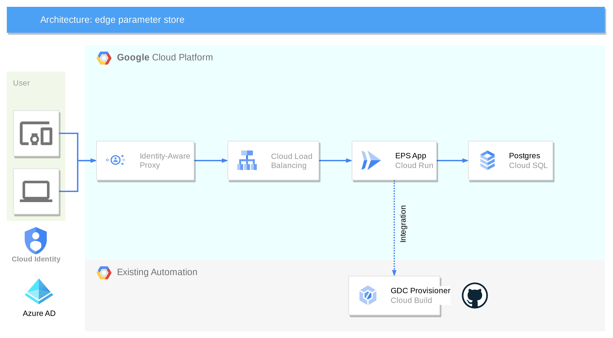

# Parameter Store

<!-- TOC -->

* [Parameter Store](#parameter-store)
    * [Description](#description)
    * [Getting Started](#getting-started)
        * [Preparation](#preparation)
            * [Install required tools](#install-required-tools)
            * [Configure GCP OAuth Consent Screen](#configure-gcp-oauth-consent-screen)
            * [Parameter Store Domain Name](#parameter-store-domain-name)
            * [Prepare fully-qualified domain name of Parameter Store app](#prepare-fully-qualified-domain-name-of-parameter-store-app)
            * [TLS Certificate](#tls-certificate)
        * [Build Image](#build-image)
        * [Deploy to GCP](#deploy-to-gcp)
            * [System Diagram](#system-diagram)
            * [Initialize Terraform](#initialize-terraform)
            * [Terraform Configuration Variables](#terraform-configuration-variables)
            * [Deploy Parameter Store App](#deploy-parameter-store-app)
            * [Rerun Terraform After First Apply](#rerun-terraform-after-first-apply)
            * [Teardown](#teardown)
    * [Cloudbuild Pipeline](#cloudbuild-pipeline)
    * [Operate Parameter Store](#operate-parameter-store)
    * [Data Loading](#data-loading)
        * [Terraform](#terraform)
        * [How Does Data Loading Work?](#how-does-data-loading-work)
    * [Local Dev](#local-dev)
        * [Postgres Setup](#postgres-setup)
        * [Python Setup](#python-setup)
        * [Django Setup](#django-setup)
    * [Additional Documentation](#additional-documentation)
    * [Appendix](#appendix)
        * [Possible Errors](#possible-errors)
        * [Dev Hacks](#dev-hacks)
    * [Disclaimer](#disclaimer)

<!-- TOC -->

## Description

This repository contains the Parameter Store, a Django application that is built to hold parameter data for
deployments of Google Distributed Cloud Connected clusters where the number of clusters may scale to tens of
thousands. It is meant to be deployed in support of other solutions and tools (in this Github organization) and as part
of a broader suite of solutions. This tool conveys the following immediate benefits:

* Stores cluster parameters specifically matching a retail edge use case
    * Supporting integration
      with [cluster provisioner](https://github.com/GDC-ConsumerEdge/automated-cluster-provisioner)
    * Supporting integration with [hydrator](https://github.com/GDC-ConsumerEdge/hydrator)
* Integrates with Google [IAP](https://cloud.google.com/security/products/iap?hl=en) for authentication and
  authorization
* Supports granular role-based access controls
* Provides a REST API
* Supports data validation workflows

## Getting Started

Go through all of the steps below to get started

- Preparation
- Build Image
- Deploy to GCP

### Preparation

This section outlines steps that the user must perform

#### Install required tools

* [Python 3.12](https://www.python.org/downloads/)
* [gcloud](https://cloud.google.com/sdk/docs/install)
* [terraform](https://developer.hashicorp.com/terraform/install)
* [docker](https://docs.docker.com/engine/install/)
* [psql client](https://docs.timescale.com/use-timescale/latest/integrations/query-admin/psql/)
  or [pgadmin](https://www.pgadmin.org/download/)

### Bootstrap the EPS GCP Project

The Terraform [README](examples/terraform/README.md) document details the GCP Service Accounts (GSA) that are required
for this project. Please ensure you have created a service account for Terraform with the required roles.
A [Terraform bootstrap project](./examples/terraform/bootstrap/) has been provided which will create the service account
and add the required roles for you.

If you wish to use the [Terraform bootstrap](./examples/terraform/bootstrap/) project, ensure you apply the bootstrap
configurations before deploying the EPS application.

```bash
cd examples/terraform/bootstrap
vi terraform.tfvars. # Edit variables for your environment
terraform init
terraform apply
```

#### Configure GCP OAuth Consent Screen

1. Login [GCP Console](https://console.cloud.google.com) and select your target project
2. Navigate to 'APIs & Services' -> 'OAuth consent screen' in the GCP Console.
   Configure the OAuth consent screen as External and set the publishing status to In Production.
   

#### Identify a domain name for the Parameter Store application

Choose a fully qualified domain name for your application. The Terraform provides an opinionated configuration for
the utilization of your FQDN, creating a managed zone in the deployment project. This assumes you will create a
delegated
zone in your application project to which an A-record for the EPS app's load balancer will be created. In doing so, it

wires the application up end-to-end. If this is not your desired configuration, you will need to modify the provided
Terraform [here](examples/terraform/dns.tf)

Set your selected fully-qualified domain name in [terraform.tfvars](examples/terraform/terraform.tfvars):

```terraform
app_fqdn = "eps.cloud.corpdomain.com"
```

Add this name or a wild card name to the CSRF trusted list, which is variable *csrf_trusted_origins*
in [terraform.tfvars](examples/terraform/terraform.tfvars) file. e.g.

```terraform
csrf_trusted_origins = ["eps.cloud.corpdomain.com"]
```

#### TLS Certificate

When using the provided Terraform, a TLS certificate is automatically generated and associated with the EPS load
balancer.

Providing and associating your own externally-managed TLS certificate is technically possible however the provided
example Terraform does not support this configuration and would require modification.

### Build Image

We will build a Docker image and push to an Artifact Registry in the target deployment GCP project. Please make sure
Artifact Registry is available and the GCP account running the build script has sufficient permissions to push images to
it.

1. Fork this project, clone your fork and go to the project workspace

    ```bash
    git clone https://github.com/Your-Org/parameter-store.git
    cd parameter-store
    ```

2. Update `terraform.tfvars` with your correct values.

3. Create an env definition file from `env.template` and update the values in `.env`
   ```bash
    cp env.template .env
   ```
3. Build the Docker image and push to Artifact Registry

    ```bash
    ./build.sh [VERSION] [APP]
    ```

* Both `VERSION` and `APP` are optional.
    * `VERSION` defaults to `0.1`
    * `APP` defaults to `parameter-store`.

* The generated image is tagged as `${REPO_HOST}/${PROJECT_ID}/${REPO_FOLDER}/${APP}:v${VERSION}`
  e.g. `us-central-docker.pkg.dev/test-proj-1234/parameter-store/parameter-store:v0.1`
    * The `latest` tag is always attached to the most recently built image

### Deploy GCP Infrastructure

Use Terraform to deploy Parameter Store infrastructure.

#### System Diagram



#### Initialize Terraform

To deploy the Parameter Store for the first time, initialize the Terraform state.

1. Go to the `examples/terraform` folder

```bash
cd examples/terraform
```

* If using local state file, e.g. for local development work, simply run

```bash
terraform init
```

* For better collaboration, we typically need to save the Terraform state file to a shared location, e.g. a GCP
  bucket. To achieve this, we need to configure a GCP bucket as Terraform backend.
    1. Create or use an existing GCS bucket. Make sure your current account has write permission to it.
    2. Create a backend configuration file (e.g., env/testing.gcs.tfbackend) with content like this:
        ```terraform
        bucket = "my-gcs-bucket-for-tfstate"
        prefix = "eps/testing"
        ```
    3. Initialize Terraform with this backend configuration: terraform init -backend-config=env/testing.gcs.tfbackend
    ```bash
    terraform init -backend-config=env/testing.gcs.tfbackend
    ```

#### Terraform Configuration Variables

The full set of Terraform variables are defined in [variables.tf](examples/terraform/variables.tf), though we will call
out notable items here.

`eps_project_id` is where the app (and nearly all) of its resources will be created. It is assumed this project already
exists.

`secrets_project_id` is the ID of a Google Cloud Project where app-related secrets are to be configured. This may be
the same as the `eps_project_id` or yet another separate project.

`eps_image` is the full name and tag of the image to be deployed by Terraform to Cloud Run on its first invocation.

`terraform_principal` is the principal associated with the EPS Terraform deployment and is very likely a Google service
account.

`iap_audience` is the "audience" against which IAP JWT tokens are compared. This comes from the backend service
associated with your load balancer stack. This value is not known until Terraform is run the first time, so on its first
invocation, an empty string (`""`) is appropriate. **After deploying infrastructure, you must fill in this value and
deploy it a second time. This value takes the form of:

```bash
"/projects/${EPS project ID}/us-central1/backendServices/${EPS load balancer backend service number}"
```

You can find this number by running the following example:

```bash
gcloud compute backend-services describe eps-lb-backend-service \
  --region=us-central1 \
  --format="value(id)"
6252277272778218001
```

`superusers` is an array of users that will automatically receive EPS "superuser" permissions upon first login. This may
be omitted, in which case superusers will need to be configured manually or at all. EPS should have at
least 1 superuser. Because EPS uses IAP its identities (usernames) are email address configured in Google Identity. EPS
uses the username portion of the email address as its username. Simply drop the `@mycorp.com`.

`eps_allowed_accessors` is an array of IAM principals that will be granted Cloud Run invoker and IAP accessor
permissions. This does not grant in-app permissions but merely allows these identities web access through IAP and into
Cloud Run. This is probably a group of users the membership of which is managed externally to Terraform.

`worker_pool_name` is a string used as a name of the private worker pool that Cloud Build will use to execute the build.
This is part of the `_PRIVATE_POOL` substitution in the [cloudbuild.tf](examples/terraform/cloudbuild.tf).

`db_password_key` is a string used as a name or identifier of the secret in Secret Manager that stores the database
password. This is passed as a substitution `_DATABASE_PASSWORD_KEY` to
the [cloudbuild.tf](examples/terraform/cloudbuild.tf).

`instance_connection_name` is a string used as a connection name for the Cloud SQL instance. This is used by the Cloud
SQL Proxy to connect to the database. Passed as `_INSTANCE_CONNECTION_NAME` in
the [cloudbuild.tf](examples/terraform/cloudbuild.tf).

`artifact_registry_project_id` is a string value for Google Cloud Project ID where the Artifact Registry is located.
Passed as `_ARTIFACT_REGISTRY_PROJECT_ID` in the [cloudbuild.tf](examples/terraform/cloudbuild.tf).

`artifact_registry_repo` is a string used as a name of the repository within Artifact Registry where images will be
stored/pulled. Passed as `_ARTIFACT_REGISTRY_REPO` in the [cloudbuild.tf](examples/terraform/cloudbuild.tf).

`app_image_name` is a string used as a name of the application image to be built or used. Passed as `_APP_IMAGE_NAME` in
the [cloudbuild.tf](examples/terraform/cloudbuild.tf).

`git_repo_url` is string value for URL of the Git repository that Cloud Build will clone. Passed as `_GIT_REPO_URL` in
the [cloudbuild.tf](examples/terraform/cloudbuild.tf).

`git_user_email` is a string value for email address to be configured for Git operations within the build environment.
Passed as `_GIT_USER_EMAIL` in the [cloudbuild.tf](examples/terraform/cloudbuild.tf).

`git_user_name` is a string value for username to be configured for Git operations within the build environment. Passed
as `_GIT_USER_NAME` in the [cloudbuild.tf](examples/terraform/cloudbuild.tf).

```terraform
environment_name             = "dev"
eps_project_id               = "example-eps"
secrets_project_id           = "example-eps"
eps_image                    = "us-docker.pkg.dev/example-eps/hsp/parameter_store:v15"
terraform_principal          = "serviceAccount:terraform@example-eps.iam.gserviceaccount.com"
app_fqdn                     = "example.eps.corp.net"
csrf_trusted_origins = ["localhost"]
iap_audience                 = "/projects/22368248810/us-central1/backendServices/506473743633145264"
superusers = ["example"]
eps_allowed_accessors = ["group:eps@example.corp.net"]
worker_pool_name             = "eps-private-pool"
db_password_key = "eps-db-pass" # Or fetch from a secure source if needed at plan time
instance_connection_name     = "example-eps:us-central1:eps-015b"
artifact_registry_project_id = "example-eps"
artifact_registry_repo       = "eps"
app_image_name               = "parameter_store"
git_repo_url                 = "https://github.com/example-eps/parameter-store.git"
git_user_email               = "example-eps@xyz.com"
git_user_name                = "example-eps-gituser"
```

#### Deploy Parameter Store App

Before using Terraform to deploy the Parameter Store application, you need to
Use `terraform plan` to check the deployment.

```bash
terraform plan
```

Use `terraform apply` to deploy the app.

```bash
terraform apply
```

#### Rerun Terraform After First Apply

The IAP audience is not known until after the first run due to unfortunate cycles in the Terraform dependency graph.

Take the output value of `jwt_audience` and set as the variable `iap_audience`. This value is available as a Terraform
output after the first successful apply. You can retrieve it using `terraform output jwt_audience`. It should look
something like:

```
/projects/22368248810/us-central1/backendServices/6252277272778218001
```

When done, rerun `terraform apply`.

#### Teardown

```bash
terraform destroy
```

This command will tear down all the GCP resources provisioned by Terraform. Note that resources not managed by
Terraform (e.g., GCS buckets for state if manually created and not imported) may require separate manual deletion.

## Cloudbuild Pipeline

This Cloud Build pipeline is designed to automate the process of building the EPS application, managing its database
schema
changes (migrations), and ensuring that these schema changes are version-controlled alongside your application code.

Files used are  [cloudbuild.tf](examples/terraform/cloudbuild.tf) and [cloudbuild.yaml](./cloudbuild.yaml)

[cloudbuild.tf](examples/terraform/cloudbuild.tf) automates the deployment of a Cloud Build CI/CD pipeline by:

**Establishing Secure GitHub Integration**: It creates a connection to your GitHub repository using the Cloud Build
GitHub App and a stored OAuth token for authenticated access.

**Granting Necessary Permissions**: It assigns the Cloud Build service agent permissions to manage secrets (specifically
for the GitHub token) ensuring it can operate correctly.

**Defining Repository and Trigger**: It links your specific GitHub repository to Cloud Build and sets up a trigger that
automatically starts a build process on pushes to the `main` branch.

**Configuring Build Execution**: It specifies that builds will run using a designated private worker pool and a
dedicated service account, with build steps and parameters defined in an external `cloudbuild.yaml` file (customized via
substitutions).

[cloudbuild.yaml](./cloudbuild.yaml) file defines a multi-step build process including:

**Download Cloud SQL Proxy (download-proxy)**: Fetches the specified version of the Cloud SQL Proxy binary required for
database connectivity.

**Make Cloud SQL Proxy Executable (chmod-proxy)**: Sets execution permissions for the downloaded Cloud SQL Proxy.

**Build Temporary Docker Image (build-temp-image)**: Creates an initial Docker image of the application tagged as
`:temp`, to be used for running subsequent tasks like migrations.

**Run Database Migrations (run-migrations)**: Using the temporary image, starts the Cloud SQL Proxy, then runs Django's
`makemigrations` to generate new database migration files for `parameter_store` and `api` apps, and copies these new
migration files to the shared `/workspace`.

**Check Copied Migrations (check-copied-migrations)**: Verifies that the database migration files generated in the
previous step have been successfully copied to the `/workspace`.

**Build Final Docker Image (build-final-image)**: Builds the definitive application Docker image, incorporating any new
migration files, and tags it with the current Git commit SHA.

**Push Final Image (push-final-image-latest)**: Pushes the final, commit-SHA-tagged Docker image to the specified Google
Artifact Registry repository.

**Commit Migrations (commit-migrations)**: Clones the application's Git repository, copies the newly generated migration
files from `/workspace` into it, and then commits and pushes these files to a new branch in the remote Git repository.

## Operate Parameter Store

* After initial deployment there is no user configuration for EPS if Terraform `superusers` variable was set
* All other users will initially have minimum permissions, allowing them to log into the system but not perform other
  actions.
* The superuser will assign permissions to users.
    * Users may log in **at least once** so that the superuser can see them in the system.
    * Alternatively, the superuser may prepopulate users based on user identity information. Please refer
      to [users-and-permissions.md](docs/users-and-permissions.md) for more information.

## Data Loading

EPS can support data loading while running in Cloud SQL. Terraform sets up EPS infrastructure to deploy Cloud SQL with
fully private networking, making it impossible to access as an operator without resorting to creative hacks. To make
this less challenging, there is an optional data loading mechanism using Cloud Build and private workers, which is
temporarily provisioned in the EPS network with access to Cloud SQL via a private networking path.

### Terraform

The Terraform folder contains optional [resources](examples/terraform/opt-gcb-data-loader.tf) to stand up infrastructure
for a Cloud Build data loader pipeline. If you do not want these [resources](examples/terraform/opt-gcb-data-loader.tf),
you should comment out or delete the resources in this folder. In addition to this file, there are references to these
resources elsewhere — search the folder for TODO lines related to the data loader and remove them.

### How Does Data Loading Work?

In the [examples/data_loader](examples/data_loader) folder there are two files:

* cloudbuild-data-loader.yaml - a cloud build pipeline which runs a data loader script
* load_db.py - an example data loader script

The `load_db.py` file is an example one-time data loader. It provides a command-line interface to load source of truth
files (CSVs) into the application, and to add some basic validators. This example file demonstrates how to load the
database with clusters and validators and should be modified to the specific use case.

The build file is expected to be submitted by a user withCloud Build Submitter IAM role (or equivalent permissions)
to the Cloud Build API. To get started, copy the `load_db.py` file into an empty directory and colocate SoT files
adjacent to it.

```bash
mkdir db_loader
cp examples/data_loader/* db_loader
cp *.csv db_loader  # these are the source of truth files, make sure they end up adjacent to the load_db.py
cd data_loader
```

Next, edit the cloudbuild-data-loader.yaml file. Be sure to update the following values in that file wherever you see a
`TODO: update me` comment.

Then submit the build job:

```bash
gcloud beta builds submit . --config=cloudbuild-data-loader.yaml --region=us-central1
```

Cloud Build will then kick off and run the data loader script, but not before establishing a private connection from its
private pool to the private IP of the database. The "Source of Truth (SoT) files" will be read, prepared, and loaded
into the database. The data loader script can be modified bespoke to your use case and even extended so that it may be
run more than once. Note it also has a `--wipe` flag so that you can erase user-loaded data and start from a fresh
dataset if needed.

## Local Dev

### Postgres Setup

1. Install PostgreSQL 16
2. Log in to PostgreSQL as a Superuser: Use the psql command-line utility to log in as the postgres user.

```bash
psql -U postgres
```

If this doesn't work, try this (this is common on Debian and perhaps other Linux distros):

```bash
sudo -u postgres psql
```

3. Create a New Database: Create a new database named eps.

```sql
CREATE
DATABASE eps;
```

4. Create a New User: Create a new user named eps with a specified password. Replace `your_password` with a strong
   password of your choice.

```sql
CREATE
USER eps WITH PASSWORD 'your_password';
```

5. Change Ownership of the Database: Alter the ownership of the `eps` database to the new user `eps`.

```sql
ALTER
DATABASE eps OWNER TO eps;
```

6. Grant Necessary Privileges to the User: Grant the necessary permissions for the eps user to manage objects within the
   eps database.

Please copy these one-by-one to the shell; they do not copy well en masse.

```sql
-- Connect to the database named 'eps'
\c
eps;

-- Grant usage on the schema 'public' to 'eps'
GRANT USAGE ON SCHEMA
public TO eps;

-- Grant create privileges on the schema 'public' to 'eps'
GRANT CREATE
ON SCHEMA public TO eps;

-- Grant all privileges on all tables in the schema 'public' to 'eps'
GRANT ALL PRIVILEGES ON ALL
TABLES IN SCHEMA public TO eps;

-- Grant all privileges on all sequences in the schema 'public' to 'eps'
GRANT ALL PRIVILEGES ON ALL
SEQUENCES IN SCHEMA public TO eps;

-- Grant privileges to create and manage tables within the 'public' schema
ALTER
DEFAULT PRIVILEGES IN SCHEMA public GRANT ALL ON TABLES TO eps;
ALTER
DEFAULT PRIVILEGES IN SCHEMA public GRANT ALL ON SEQUENCES TO eps;
```

### Python Setup

These setup instructions assume the use of [uv](https://docs.astral.sh/uv/)

1. Install required Python packages

```bash
uv sync
```

2. Define local environment database configuration (optional)

The default database configuration for the Parameter Store application can be found
in [settings.py](./parameter_store/settings.py).
To override these settings for your local environment, define relevant environment variables as needed.

```bash
export DB_NAME="my-eps-db"
export DB_USER="eps-dev-user"
export DB_PASSWORD="eps-dev-password"
export DB_HOST="localhost"
export DB_PORT="5555"
```

### Django Setup

1. Run Django Migrations

```bash
uv run manage.py makemigrations
uv run manage.py migrate
```

2. Collect static files

```bash
uv run manage.py collectstatic
```

2. Create a Superuser: Create a superuser for accessing the Django admin interface:

```bash
uv run manage.py createsuperuser
```

3. Start the Development Server: Run the Django development server to check if everything is working fine:

```bash
export DJANGO_DEBUG=True
uv run manage.py runserver
```

## Testing

This project uses `pytest` as its testing framework. Tests are located in the `parameter_store/tests/` directory.

### Running Tests

Before running tests, ensure you have installed the development dependencies:

```bash
uv sync --dev
```

To run the full test suite, execute `pytest` from the project root. Increased verbosity is recommended:

```bash
uv run pytest -vv
```

You can also run specific test files or individual tests:

```bash
# Run a specific file
uv run pytest -vv parameter_store/tests/test_changeset_actions.py

# Run a specific test function by name
uv run pytest -vv -k "test_commit_changeset"
```

## Additional Documentation

Please see [docs](./docs) for more documentation:

* [Users and Permissions](docs/users-and-permissions.md)
* [Programmatic Access with Google Service Accounts via IAP](docs/iap-programmatic-access.md)

## Appendix

### Possible Errors

Sometimes Django doesn't seem to pick up the models for `parameter_store`, so I have to `makemigrations` explicitly for
it:

```bash
uv run manage.py makemigrations parameter_store
uv run manage.py migrate
```

If successful, it looks something like:

```bash
$ uv run manage.py makemigrations parameter_store
Migrations for 'parameter_store':
  parameter_store/migrations/0001_initial.py
    + Create model Cluster
    + Create model GlobalRole
    + Create model Group
    + Create model Tag
    + Create model ClusterFleetLabel
    + Create model ClusterIntent
    + Create model ClusterRole
    + Add field group to cluster
    + Create model GroupRole
    + Create model ClusterTag

$ uv run manage.py migrate
Operations to perform:
  Apply all migrations: admin, auth, contenttypes, parameter_store, sessions
Running migrations:
  Applying parameter_store.0001_initial... OK

```

### Dev Hacks

I have Postgres running on a remote Linux device (called `cloudtop`) while I develop locally, so I port-forward to psql
on that device:

```bash
ssh -TL 5432:localhost:5432 cloudtop
```

## Disclaimer

This project is not an official Google project. It is not supported by
Google and Google specifically disclaims all warranties as to its quality,
merchantability, or fitness for a particular purpose.
