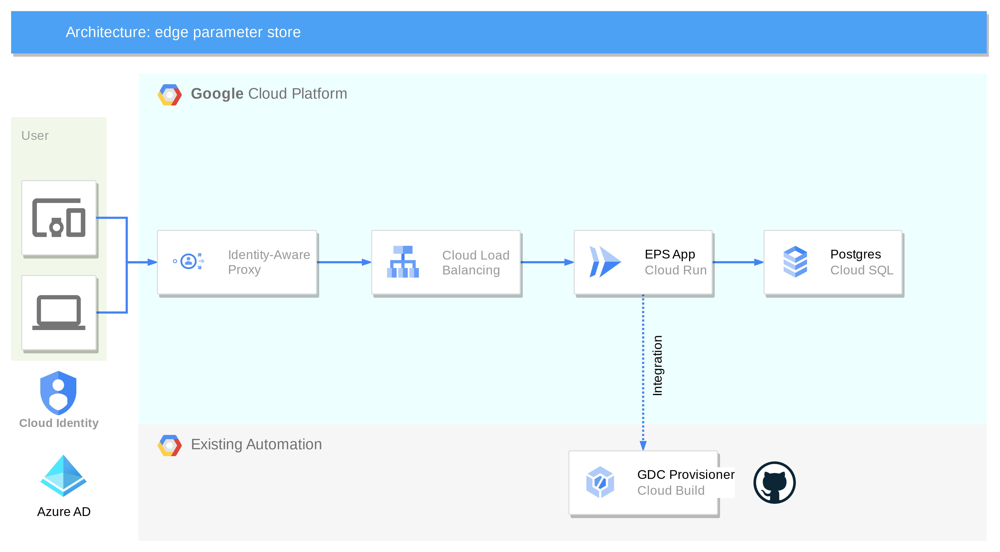
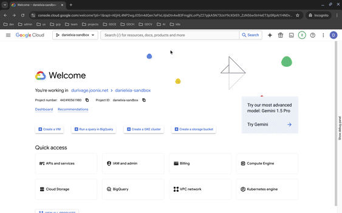

# parameter_store
## Preparation
### Install required tools
* [Python 3.13](https://www.python.org/downloads/)
* [gcloud](https://cloud.google.com/sdk/docs/install)
* [terraform](https://developer.hashicorp.com/terraform/install)
* [docker](https://docs.docker.com/engine/install/)
* [psql client](https://docs.timescale.com/use-timescale/latest/integrations/query-admin/psql/) or [pgadmin](https://www.pgadmin.org/download/)
### Configure GCP OAuth Consent Screen
1. Login [GCP Console](https://console.cloud.google.com) and select your target project
2. Go to **Google Auth Platform** and configure OAuth consent screen.  
Configure the app as **External** and **In Production** app

### Cloud SQL (Postgres)
1. Create a [Cloud SQL Postgres DB](https://cloud.google.com/sql/postgresql?hl=en) instances in your project, or use an existing one in your project.   
> * Assign this instance name to <span style="color:purple">*eps_db_instance*</span> in [terraform.tfvars](./deployment/terraform.tfvars).
2. Within this db instance, create a db named <span style="color:blue">*eps*</span>
> * assign this db name to <span style="color:purple">*eps_db_name*</span> in [terraform.tfvars](./deployment/terraform.tfvars)
### Public IP Address for Loadbalancer
Reserve a *regional standard* public IP address in *your project*, and name it <span style="color:blue">*eps-lb-ip*</span>  
```bash
gcloud compute addresses create eps-lb-ip --project=<project_id> --region=<your_region>
```   
> * this IP Address is referred in [main.tf](./deployment/main.tf) as <span style="color:purple">*google_compute_address.eps_lb_ip*</span>
### Prepare DNS name of Parameter Store app
System administrators need to assign a DNS name to app, and update DNS server to resolve this name to the IP address created [above](#public-ip-address-for-loadbalancer).  

Assuming <span style="color:blue">*eps.mycompany.com*</span> is the DNS name selected for your parameter store app. You need to 
1. purchase an SSL cert with this domain name
2. Add this name, or a wild card name to the CSRF trusted list, which is variable <span style="color:purple">*csrf_trusted_origins*</span> in [terraform.tfvars](deployment/terraform.tfvars) file. e.g.  
```properties
csrf_trusted_origins    = ["*.internal", "*.mycompany.com"]
```
> * For dev deployment we can use some internal domain names, like <span style="color:blue">*eps.gdc.internal*</span>.  
> * For testing purpose, we can update the DNS mapping in local <span style="color:blue">/etc/hosts</span> file, e.g.
> ```properties
> # assuming 12.34.56.78 is your load balancer IP
> 12.34.56.78	eps.gdc.internal
> ```
### SSL Certificate
Once the DNS name is decided, we need to acquire an SSL cert for the Parameter Store App.  
This cert will be applied on the loadbalancer's frontend.
* For production deployment  
Please purchase a cert signed by trusted CAs.
* For development deployment  
A self-signed cert could be used to save cost.  
* To generate a self-signed cert
```bash
openssl req -x509 -newkey rsa:2048 -sha256 -days 3650 \
  -nodes -keyout key.pem -out cert.pem \
  -subj "/CN=eps.gdc.internal" \
  -addext "subjectAltName=DNS:eps.gdc.internal"
```
This command generates a cert file <span style="color:blue">cert.pem</span> and a private key file <span style="color:blue">key.pem</span> in the current directory. The domain name of the site is <span style="color:blue">eps.gdc.internal</span>  
> **Note:** Currently GCP won't accept self-signed RSA key longer than 2048.

Add this cert to deployment GCP project with the following command. This cert name (**eps-cert**) will be assigned to  <span style="color:purple">*eps_cert_name*</span> in [terraform.tfvars](./deployment/terraform.tfvars)
```bash
gcloud beta compute ssl-certificates create eps-cert \
  --certificate=cert.pem \
  --private-key=key.pem \
  --region=<target deploy region>
```
### Create IAP Service Identity and Assign Roles
This is a one-off task for a GCP project.  
1. Create the service account used by IAP.  
```bash
gcloud beta services identity create --service=iap.googleapis.com --project=<project_id>
```  
It should create a service account for IAP, typically the named is  
<span style="color:blue">*service-<project_number>@gcp-sa-iap.iam.gserviceaccount.com*</span>  
2. Assign <span style="color:blue">*roles/run.invoker*</span> role to this service account, to allow IAP to invoke Cloud Run (the Parameter Store app).  
```bash
gcloud projects add-iam-policy-binding <project_id> \
  --member='serviceAccount:service-<project_number>@gcp-sa-iap.iam.gserviceaccount.com' \
  --role='roles/run.invoker'
```
### Automation Integration related resources
In the current automation solution, the source of truth is store in a csv file in a gitlab repository.  
To keep backward compatible and gradual evolution, parameter store provides integration to the current automation solution, by updating the database content to the target csv file.  
To enable this integration, the following information needs to be provided to parameter store app, by setting up the following variables in [terraform.tfvars](./deployment/terraform.tfvars)
```properties
source_of_truth_repo  # GitLab or GitHub repo url (without https://) of the repo where source of truth csv file stored
source_of_truth_branch  # repo branch name
source_of_truth_path  # file path to the sot csv file within the repo, include the file name itself
git_secret_id  # name of the secret of the repo access token. This token is stored in google secret manager
project_id_secrets  # the gcp project id where the git secret stored, if different from the deployment project
```
* There is a simple Rest API defined at <span style="color:blue">/api/update_sot</span>  
Making a GET request (without any parameters) to this url, will trigger the app to dump the database content and save to the csv file in the git repo.
## Build Image
We will build a docker image and push to an artifact registry in target deployment GCP project. Please make sure the artifact registry is available and GCP account running the build script has sufficient permission to push image to it. 
1. Clone this project and go to the project workspace
```bash
mkdir parameter-store
cd parameter-store
git clone https://github.com/GDC-ConsumerEdge/parameter-store.git .
```
2. Create python virtual environment and activate it
```bash
python3 -m venv .venv
source .venv/bin/activate
```
3. Define local build environment, by creating a .env file in the project directory
```bash
copy env.template .env
```  
edit the .env file and update the following parameters
* PROJECT_ID  
This is the same project id as  your target deployment project
* REPO_HOST  
Your repo host name, e.g. **gcr.io**, or **us-central1-docker.pkg.dev**
* REPO_FOLDER  
The folder name under the artifact registry.  
By default to use **parameter-store**.

4. build the docker image and push to artifact registry
```bash
./build.sh [VERSION] [APP]
```
* Both **VERSION** and **APP** are optional.  
**VERSION** default to *0.1*, while **APP** default to *parameter-store*.  
* The generated image is tagged as `${REPO_HOST}/${PROJECT_ID}/${REPO_FOLDER}/${APP}:v${VERSION}`  
e.g. `gcr.io/test-proj-1234/parameter-store/parameter-store:v0.1`
* The `latest` tag is always attached to the most recently built image
## Deploy to GCP
We use terraform to deploy parameter store apps to a GCP project
### System Diagram
 
### Initialize Terraform
For the first time to deploy parameter store, we need to initialize terraform state.
1. go to `deployment` folder
```bash
cd deployment
```
* If using local state file, e.g. for local development work, simply run
```bash
terraform init
```
* For better collaboration, most of the time we need to save the terraform state file to a shared place, e.g. a GCP bucket. To achieve this, we need to configure a GCP bucket as terraform backend.
  1. Create or using an existing GCS bucket. Make sure your current account has write permission to it.
  2. Create/Modify a terraform backend config file in [deployment/env](./deployment/env) folder. e.g. [testing.gcs.tfbackend](./deployment/env/testing.gcs.tfbackend). Configure the following parameters
     * bucket &rarr; The gcs bucket name for terraform state files
     * prefix &rarr; The top level folder name under the bucket where the state file are saved.  
     e.g.
        ```properties
        bucket = "danielxia-tf-back"
        prefix = "testing"
        ```
  3. initialize terraform with backend config
    ```bash
    terraform init -backend-config=env/testing.gcs.tfbackend
    ```
### Configure Terraform Variables
Define all the deployment variables in [terraform.tfvars](deployment/terraform.tfvars)
* project_id  
The target gcp project where the parameter store app will be deployed.


* region  
The target region where the parameter store app will be deployed.


* eps_db_instance
* eps_db_name
* eps_db_user
* eps_db_password  
The cloud sql instance as defined in [Cloud SQL (Postgres)](#cloud-sql-postgres).


* project_id_secrets
* source_of_truth_repo
* source_of_truth_branch
* source_of_truth_path
* git_secret_id  
The integration parameters as defined in [Automation Integration related resources](#automation-integration-related-resources)  


* csrf_trusted_origins  
This list should include the DNS name you assigned to your Parameter Store app, as stated in [Prepare DNS name of Parameter Store app](#prepare-dns-name-of-prameter-store-app)


e.g.
```properties
project_id          = "danielxia-sandbox"
region              = "us-central1"

eps_db_instance     = "test-db"
eps_db_name         = "eps"
eps_db_user         = "eps"
eps_db_password     = "123456"

project_id_secrets      = "danielxia-sandbox"
source_of_truth_repo    = "gitlab.com/daniell76/test_2"
source_of_truth_branch  = "main"
source_of_truth_path    = "test_sot_iap.csv"
git_secret_id           = "daniel-gl-pat"

csrf_trusted_origins    = ["*.internal", "*.mycompany.com"]
```
### More Deployment Variables
A complete list of deployment variables are defined in [variables.tf](deployment/variables.tf)  
Most of the optional variables have default values.
### Deploy Parameter Store App
Use `terraform plan` to check the deployment.
```bash
terraform plan
```
Use `terraform apply` to deploy the app.  
You need to answer yes when prompting, to confirm the deployment action.
```bash
terraform apply
```
### Enable IAP for Parameter Store
After terraform deployed the app. This final step must be done via **GCP Console**
1. Go to **Security** &rarr; **Identity-Aware Proxy**
2. Find the backend service of parameter store app and enable IAP.  
If you deploy with the default argument, the name should be <span style="color:blue">*eps-lb-backend-service*</span>

3. Enable IAP from console will automatically create an OAuth2 client.  
User can view this info in Google Auth Platform as discussed in [Configure GCP OAuth Consent Screen](#configure-gcp-oauth-consent-screen)
### Teardown
```bash
terrform destroy
```
This command will tear down all the gcp resources provisioned by terraform.  
Manual created resource requires manual deletion, including  
* OAuth Client created in [above section](#enable-iap-for-parameter-store)
* The [Public IP Address](#public-ip-address-for-loadbalancer) reserved for Loadbalancer
* The [self-signed cert](#ssl-certificate), if created.
## Operate Parameter Store
* After initial deployment, there is no user configure for parameter store app. The first logged-in user will automatically become **Superuser**
* All the following users will be assigned with minimum permissions, i.e. they can just log in system but not doing anything else.
* The superuser will be responsible to assign permission to users. But users must log in **at least once** so that the superuser can see them on the system.
## Local Dev

### Postgres Setup

1. Install Postgres 16
2. Log in to PostgresSQL as a Superuser: Use the psql command-line utility to log in as the postgres user.

```bash
psql -U postgres
```

3. Create a New Database: Create a new database named eps.

```sql
CREATE DATABASE eps;
```

4. Create a New User: Create a new user named eps with a specified password. Replace your_password with a strong password of your choice.

```sql
CREATE USER eps WITH PASSWORD 'your_password';
```

5. Change Ownership of the Database: Alter the ownership of the eps database to the new user eps.

```sql
ALTER DATABASE eps OWNER TO eps;
```

6. Grant Necessary Privileges to the User: Grant the necessary permissions for the eps user to manage objects within the eps database.

```sql
-- Connect to the database named 'eps'
\c eps

-- Grant usage on the schema 'public' to 'eps'
GRANT USAGE ON SCHEMA public TO eps;

-- Grant create privileges on the schema 'public' to 'eps'
GRANT CREATE ON SCHEMA public TO eps;

-- Grant all privileges on all tables in the schema 'public' to 'eps'
GRANT ALL PRIVILEGES ON ALL TABLES IN SCHEMA public TO eps;

-- Grant all privileges on all sequences in the schema 'public' to 'eps'
GRANT ALL PRIVILEGES ON ALL SEQUENCES IN SCHEMA public TO eps;

-- Grant privileges to create and manage tables within the 'public' schema
ALTER DEFAULT PRIVILEGES IN SCHEMA public GRANT ALL ON TABLES TO eps;
ALTER DEFAULT PRIVILEGES IN SCHEMA public GRANT ALL ON SEQUENCES TO eps;
```

7. 

### Python Setup

1. Install Python 3.12

2. Create virtualenv

```bash
python3 -m venv .venv
```

3. Install dev requirements

```bash
pip3 install -r requirements.txt
pip3 install -r requirements-dev.txt
```

### Django Setup

1. Run Django Migrations

```shell
python manage.py makemigrations
python manage.py migrate
```

2. Create a Superuser: Create a superuser for accessing the Django admin interface:

```shell
python manage.py createsuperuser
```

3. Start the Development Server: Run the Django development server to check if everything is working fine:

```shell
python manage.py runserver
```

## Appendix

### Possible Errors

Sometimes Django doesn't seem to pick up the models for `parameter_store`, so I have to `makemigrations` explicitly for it:

```shell
python3 manage.py makemigrations parameter_store
python3 manage.py migrate
```

If succesful, it looks something like:

```shell
$ python3 manage.py makemigrations parameter_store
Migrations for 'parameter_store':
  parameter_store/migrations/0001_initial.py
    + Create model Cluster
    + Create model GlobalRole
    + Create model Group
    + Create model Tag
    + Create model ClusterFleetLabel
    + Create model ClusterIntent
    + Create model ClusterRole
    + Add field group to cluster
    + Create model GroupRole
    + Create model ClusterTag

$ python3 manage.py migrate
Operations to perform:
  Apply all migrations: admin, auth, contenttypes, parameter_store, sessions
Running migrations:
  Applying parameter_store.0001_initial... OK

```

### Dev Hacks

I have Postgres running on my cloudtop while I dev locally, so I port-forward to psql on the cloudtop:

```shell
ssh -TL 5432:localhost:5432 cloudtop
```

## Disclaimer

This project is not an official Google project. It is not supported by
Google and Google specifically disclaims all warranties as to its quality,
merchantability, or fitness for a particular purpose.