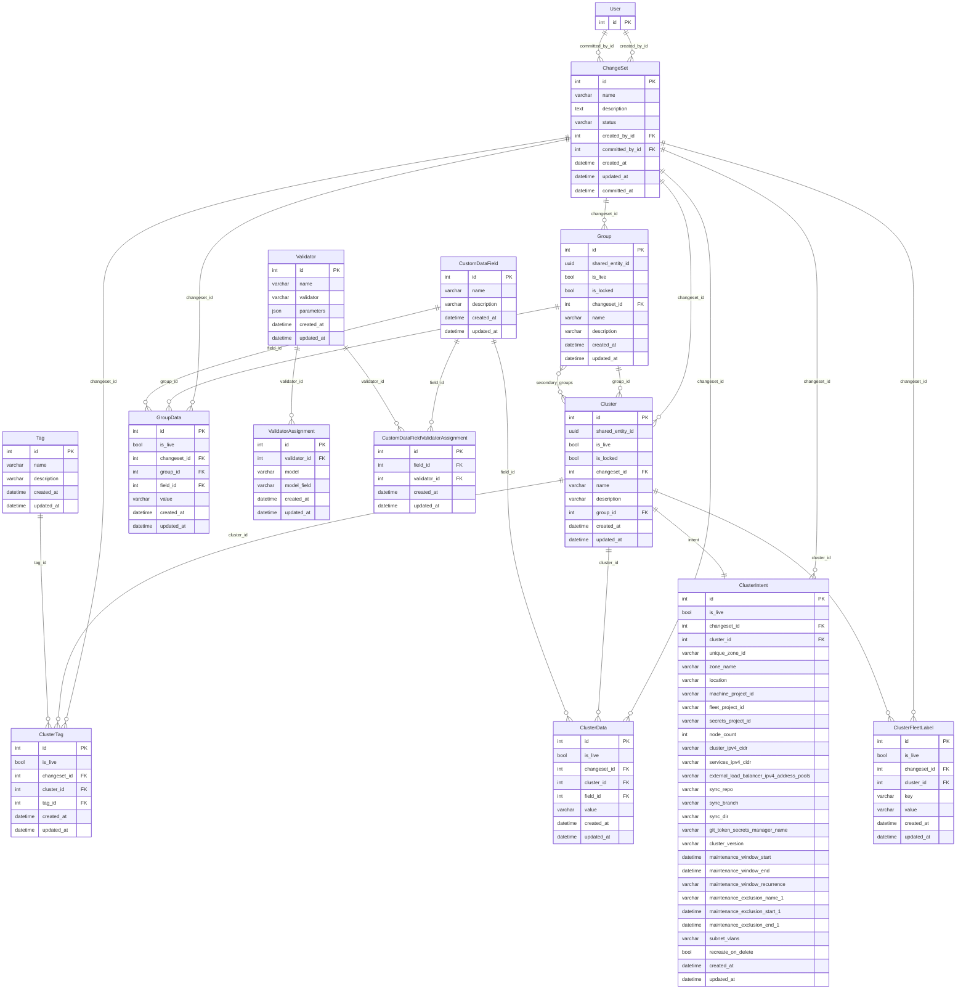

```mermaid
erDiagram
    ChangeSet {
        int id PK
        varchar name
        text description
        varchar status
        int created_by_id FK
        int committed_by_id FK
        datetime created_at
        datetime updated_at
        datetime committed_at
    }

    Group {
        int id PK
        uuid shared_entity_id
        bool is_live
        bool is_locked
        int changeset_id FK
        varchar name
        varchar description
        datetime created_at
        datetime updated_at
    }

    Cluster {
        int id PK
        uuid shared_entity_id
        bool is_live
        bool is_locked
        int changeset_id FK
        varchar name
        varchar description
        int group_id FK
        datetime created_at
        datetime updated_at
    }

    Tag {
        int id PK
        varchar name
        varchar description
        datetime created_at
        datetime updated_at
    }

    ClusterTag {
        int id PK
        bool is_live
        int changeset_id FK
        int cluster_id FK
        int tag_id FK
        datetime created_at
        datetime updated_at
    }

    ClusterIntent {
        int id PK
        bool is_live
        int changeset_id FK
        int cluster_id FK
        varchar unique_zone_id
        varchar zone_name
        varchar location
        varchar machine_project_id
        varchar fleet_project_id
        varchar secrets_project_id
        int node_count
        varchar cluster_ipv4_cidr
        varchar services_ipv4_cidr
        varchar external_load_balancer_ipv4_address_pools
        varchar sync_repo
        varchar sync_branch
        varchar sync_dir
        varchar git_token_secrets_manager_name
        varchar cluster_version
        datetime maintenance_window_start
        datetime maintenance_window_end
        varchar maintenance_window_recurrence
        varchar maintenance_exclusion_name_1
        datetime maintenance_exclusion_start_1
        datetime maintenance_exclusion_end_1
        varchar subnet_vlans
        bool recreate_on_delete
        datetime created_at
        datetime updated_at
    }

    ClusterFleetLabel {
        int id PK
        bool is_live
        int changeset_id FK
        int cluster_id FK
        varchar key
        varchar value
        datetime created_at
        datetime updated_at
    }

    CustomDataField {
        int id PK
        varchar name
        varchar description
        datetime created_at
        datetime updated_at
    }

    ClusterData {
        int id PK
        bool is_live
        int changeset_id FK
        int cluster_id FK
        int field_id FK
        varchar value
        datetime created_at
        datetime updated_at
    }

    GroupData {
        int id PK
        bool is_live
        int changeset_id FK
        int group_id FK
        int field_id FK
        varchar value
        datetime created_at
        datetime updated_at
    }

    Validator {
        int id PK
        varchar name
        varchar validator
        json parameters
        datetime created_at
        datetime updated_at
    }

    ValidatorAssignment {
        int id PK
        int validator_id FK
        varchar model
        varchar model_field
        datetime created_at
        datetime updated_at
    }

    CustomDataFieldValidatorAssignment {
        int id PK
        int field_id FK
        int validator_id FK
        datetime created_at
        datetime updated_at
    }

    User {
        int id PK
    }

    ChangeSet ||--o{ Group : "changeset_id"
    ChangeSet ||--o{ Cluster : "changeset_id"
    ChangeSet ||--o{ ClusterTag : "changeset_id"
    ChangeSet ||--o{ ClusterIntent : "changeset_id"
    ChangeSet ||--o{ ClusterFleetLabel : "changeset_id"
    ChangeSet ||--o{ ClusterData : "changeset_id"
    ChangeSet ||--o{ GroupData : "changeset_id"

    User ||--o{ ChangeSet : "created_by_id"
    User ||--o{ ChangeSet : "committed_by_id"

    Group ||--o{ Cluster : "group_id"
    Group ||--o{ GroupData : "group_id"
    Group }o--o{ Cluster : "secondary_groups"

    Cluster ||--o{ ClusterTag : "cluster_id"
    Cluster ||--|| ClusterIntent : "intent"
    Cluster ||--o{ ClusterFleetLabel : "cluster_id"
    Cluster ||--o{ ClusterData : "cluster_id"

    Tag ||--o{ ClusterTag : "tag_id"

    CustomDataField ||--o{ ClusterData : "field_id"
    CustomDataField ||--o{ GroupData : "field_id"
    CustomDataField ||--o{ CustomDataFieldValidatorAssignment : "field_id"

    Validator ||--o{ ValidatorAssignment : "validator_id"
    Validator ||--o{ CustomDataFieldValidatorAssignment : "validator_id"
```
