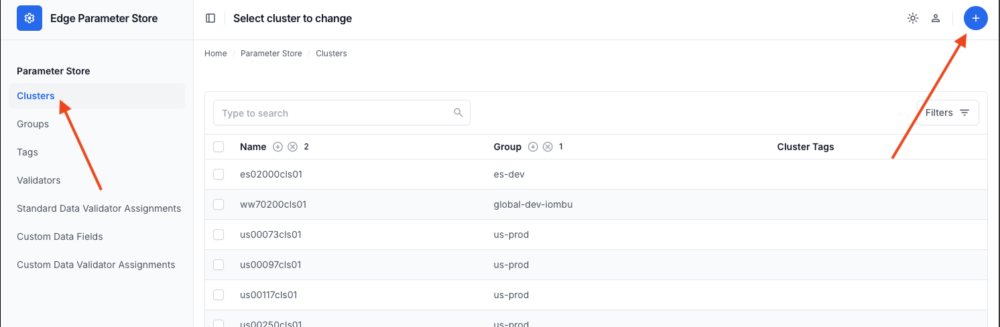

# Parameter Store User Guide

This guide provides an overview of how to manage your data using the **ChangeSet** system.

Think of EPS like a library.
*   **Live Data**: These are the books on the shelves that everyone can access.
*   **ChangeSet**: This is your personal workspace. When you want to add or modify data, you do it here first.
*   **Commit**: This is the action of finalizing your work and publishing it for everyone to see.

---

## Part 1: Using the Admin UI

The Admin UI is the primary interface for browsing and editing data. It includes safeguards to ensure data integrity through the ChangeSet workflow.

### 1. Understanding ChangeSets
A **ChangeSet** groups related modifications—edits, creations, and deletions—into a single unit of work.
*   **Draft**: A ChangeSet in progress. Changes here are visible only to you (and those viewing your specific ChangeSet).
*   **Committed**: A finalized ChangeSet. Its changes have been applied to the "Live" data.

### 2. Creating and Editing Data

When you add or edit a Group or Cluster, the system automatically handles the versioning for you.

#### Adding Clusters
1.  In the left pane, click **Clusters**.
2.  Click the **plus icon (+)** in the upper right to add a new one.
    
3.  Fill out the form. Required fields have a red asterisk (*).
    
4.  Click **Save**.

**What happens next?**
*   EPS detects a modification.
*   It automatically creates a **Draft** version of your item.
*   This Draft is placed into an **Active ChangeSet**. If you don't have one open, a new one is created for you.
*   You are redirected to your new Draft. Look for the blue badge labeled **Draft in active ChangeSet**.

<div style="background-color: #ffebee; border: 2px solid #ef5350; border-radius: 8px; padding: 16px; margin: 20px 0; text-align: center;">
    <strong style="color: #c62828; font-size: 1.2em;">📸 MISSING SCREENSHOT: Draft Badge in Admin UI (Blue Badge)</strong>
</div>

#### Editing Clusters
1.  Click **Clusters** on the left.
2.  Search for the cluster you want to modify and click its name.
3.  Update the necessary fields.
4.  Click **Save**.

Just like adding a cluster, this creates a **Draft** copy. The original "Live" cluster remains unchanged until you Commit.

### 3. Deleting Data
Deleting items is a safe, staged process.

1.  Select the items you want to delete in the list view, or click **Delete** on a specific item page.
2.  Confirm the deletion.

**What happens next?**
*   The item is **not** removed immediately.
*   It is marked as **Staged for Deletion**.
*   It will appear in your ChangeSet with a red **Pending Deletion** badge.
*   If this was a mistake, you can simply delete the *draft*, and the original Live item remains untouched.

<div style="background-color: #ffebee; border: 2px solid #ef5350; border-radius: 8px; padding: 16px; margin: 20px 0; text-align: center;">
    <strong style="color: #c62828; font-size: 1.2em;">📸 MISSING SCREENSHOT: Pending Deletion Badge (Red Badge)</strong>
</div>

### 4. Committing Changes
Once you have reviewed your edits, creations, and deletions, you can apply them to the live system.

1.  Go to the **ChangeSets** menu on the left.
2.  Locate your ChangeSet (it will be in `Draft` status).
3.  Select the checkbox next to it.
4.  In the "Actions" dropdown at the top, select **Commit selected ChangeSets**.
5.  Click **Go**.

<div style="background-color: #ffebee; border: 2px solid #ef5350; border-radius: 8px; padding: 16px; margin: 20px 0; text-align: center;">
    <strong style="color: #c62828; font-size: 1.2em;">📸 MISSING SCREENSHOT: ChangeSet List View with "Commit" Action Selected</strong>
</div>

**Success!** All drafts in the ChangeSet are now Live. Previous versions are archived in the history.

### 5. Additional ChangeSet Actions
*   **Abandon**: If a ChangeSet is no longer needed or contains errors, select it and choose **Abandon selected ChangeSets**. This deletes all associated drafts and unlocks the items for others.
*   **Coalesce**: If you have multiple ChangeSets that should be merged into a single update, select them all and choose **Coalesce selected ChangeSets**. They will be merged into the first selected ChangeSet.

---

## Part 2: Advanced Features

### Fleet Labels
Fleet labels act as key/value identifiers for your clusters. You can add them when adding or editing a cluster.


### Tags
Tags facilitate filtering and organizing clusters.
1.  Go to **Tags** and click the **plus (+)** icon.
    
2.  Enter a name and click **Save**.
    
3.  This tag can now be associated with any Cluster.
    

### Cluster Intent
Cluster Intent defines the data used to provision clusters automatically.
1.  When editing a cluster, scroll to **Cluster Intent**.
2.  Click **Add another Cluster Intent** (or edit the existing one).
    
3.  Complete the form and click **Save**.

### Custom Data
Use Custom Data to store additional, user-defined information.
1.  Go to **Custom Data Fields** and click **plus (+)**.
    
2.  Name your field and click **Save**.
    
3.  Navigate to a Cluster or Group, scroll to **Custom Data**, and enter a value for your new field.
    

### Data Validators
Validators ensure data integrity by enforcing rules on field values.
1.  Go to **Validators** and click **plus (+)**.
2.  Select a validator type (e.g., `EnumValidator` to restrict values to a list).
3.  Add parameters such as `{"choices": ["north", "south"]}`.
    
4.  **Associate** the validator with a field using **Validator Assignments**.
    
5.  If a user attempts to save an invalid value, EPS will reject the input.
    

---

## Part 3: Using the API

The API provides programmatic access to EPS functionality, suitable for scripts and automation.

### Constraint: Live Data is Read-Only
**You cannot modify Live data directly.**
Every `POST` (create), `PUT` (update), or `DELETE` operation **MUST** include a `changeset_id` to ensure changes are tracked and versioned.

### Working with Entity IDs
*   **`id` (UUID)**: This is the **Shared Entity ID**. It is a unique identifier (e.g., `a1b2c3d4...`) that persists across all versions (Live, Draft, History) of an object. **Use this ID for all API operations.**
*   **`record_id` (Integer)**: This is the specific database row ID for a single version. It changes with every new draft and is primarily used for internal debugging.

### Workflow Example

#### Step 1: Create a ChangeSet
Create a new workspace for your changes.
```bash
curl -X POST "http://localhost:8000/api/v1/changeset" \
     -H "Content-Type: application/json" \
     -d '{"name": "my-api-update", "description": "Updating clusters via script"}'
```
**Response:**
```json
{ "id": 42, "status": "draft", ... }
```
Note the ChangeSet ID (`42`) for subsequent requests.

#### Step 2: Create or Update a Cluster
To update a cluster, use its UUID (`a1b2c3d4...`) and provide the `changeset_id`.

```bash
curl -X PUT "http://localhost:8000/api/v1/cluster/id/a1b2c3d4-..." \
     -H "Content-Type: application/json" \
     -d '{
           "description": "Updated via API",
           "changeset_id": 42
         }'
```
This action creates a **Draft** of the cluster within ChangeSet 42.

#### Step 3: Review Changes
Retrieve a summary of all pending changes in the ChangeSet.

```bash
curl -X GET "http://localhost:8000/api/v1/changeset/42/changes"
```
**Response:**
```json
{
  "groups": [],
  "clusters": [
    {
      "action": "update",
      "entity": { "name": "my-cluster", "description": "Updated via API", ... }
    }
  ]
}
```

#### Step 4: Commit
Apply the changes to the live environment.

```bash
curl -X POST "http://localhost:8000/api/v1/changeset/42/commit"
```

### Viewing History
Retrieve the version history of a cluster.

```bash
curl -X GET "http://localhost:8000/api/v1/cluster/my-cluster/history"
```
This returns a chronological list of previous versions, including metadata on who made the changes and when.

---

## Glossary

*   **ChangeSet**: A logical grouping of staged changes (creations, updates, deletions).
*   **Draft**: A pending version of an entity (Cluster or Group) that has not yet been applied to the live environment.
*   **Live**: The currently active, approved version of an entity.
*   **Shared Entity ID (UUID)**: The persistent unique identifier that connects all versions (Live, Draft, History) of a single logical object.
