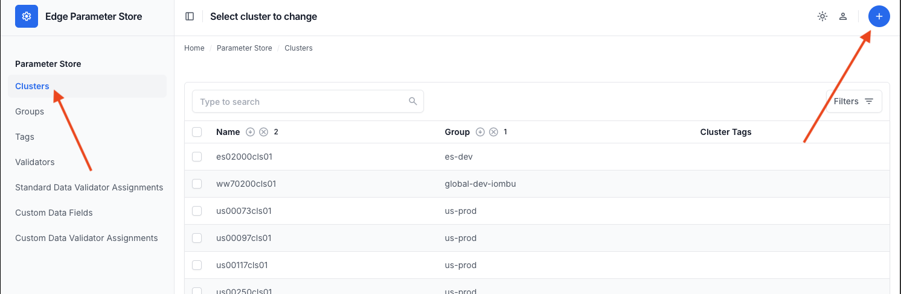

# EPS Key User Journeys

## Adding Clusters

1. In the left pane, click _Clusters_ and the new cluster _plus_ icon in the upper right
   
2. You may now add a new cluster. Required fields are marked with a red asterisk. Related objects are shown inline in
   the add cluster view.
   
3. When complete, click the appropriate _Save_ button at the bottom of the scren
4. Validators are run against fields if defined and will report any data errors

### Notes

* A group may be added dynamically, meaning that a _net new_ group may be added and associated with a cluster without
  being defined first
* Cluster custom data fields _must_ be defined before being used in a new cluster
* Cluster tags _must_ be created before being associated with a cluster
* Fleet labels are arbitrary key/value pairs; as many pairs may be added as needed.
* Cluster intent may _only_ be defined once

## Editing Clusters

1. In the left pane, click _Clusters_
2. Search for the requisite cluster and click on its row in the table
   
3. When complete, click the appropriate _Save_ button at the bottom of the scren
4. Validators are run against fields if defined and will report any data errors

### Notes

* A group may be added dynamically, meaning that a _net new_ group may be added and associated with a cluster without
  being defined first
* Cluster custom data fields _must_ be defined before being used in a new cluster
* Cluster tags _must_ be created before being associated with a cluster
* Fleet labels are arbitrary key/value pairs; as many pairs may be added as needed.
* Cluster intent may _only_ be defined once

## Fleet Labels

Fleet labels are key/value pairs associated with a cluster. THey are the EPS representation of fleet memebership labels,
and example of which may be
found [here](https://cloud.google.com/config-connector/docs/reference/resource-docs/gkehub/gkehubmembership).

To create a fleet label, either [add](#adding-clusters) or [edit](#editing-clusters) a cluster's fleet labels in the
form.


## Tags

Tags are string values associated with a cluster. They are primarily used for advanced filtering when querying the API.
In order to associate a tag with a cluster, it must be created first.

1. Go to _Tags_ and click the _plus_ icon
   
2. Add a tag name
   
3. Click the appropriate _Save_ button when complete
4. To associate with a cluster, [add](#adding-clusters) or [edit](#editing-clusters) a cluster
5. Scroll to _Tags_ within the _Cluster_ view
6. To replace a tag, select an existing tag from the drop down
7. To add a tag, click `Add another Cluster Tag` and select the appropriate tag from the dropdown
   

## Cluster Intent

Cluster intent contains cluster data that is used
by [cluster provisioner](https://github.com/GDC-ConsumerEdge/automated-cluster-provisioner) to create clusters from
zones. This data is prescriptive and not custom and is associated to a cluster for the purposes of creating it when its
zone is onlined. To add this data to a cluster:

1. [Add](#adding-clusters) or [edit](#editing-clusters) a cluster
2. Scroll to the _Cluster Intent_ section
3. If the cluster is new, click _Add another Cluster Intent_
   
4. If intent already exists, you will see a Cluster Intent section with form fields
   
5. Fill out the optional and required content designated with a red asterisk
6. Click the appropriate _Save_ button when complete

## Custom Data

Custom data is user-specified custom data to be associated with clusters. This represents customer-specific data that is
relevant to downstream consumers of EPS data, such as extra data that is used
by [hydrator](https://github.com/GDC-ConsumerEdge/hydrator).

To use cluster custom data, you must first create the _custom data field_. Once it is created, you may then associate it
with a cluster and provide a cluster-specific value to that field.

1. Go to _Custom Data Fields_ in the left pane and click the _plus_ icon
   
2. Add a custom data field name to _Name_
   
3. Click the appropriate _Save_ button when complete.
4. You may now assoicate this field with a cluster. To associate with a cluster, [add](#adding-clusters)
   or [edit](#editing-clusters) a cluster.
5. Scroll down to _Cluster Custom Data_ and click _Add Another Cluster Custom Data_
6. Select the field from the dropdown and fill in the field value
   
7. Click the appropriate _Save_ button when complete

## Data Validators

Data validators validate data. They operate over two types of data: standard data fields, the types that are provided by
EPS automatically; and custom data, which are custom fields created by users.

Available validators are defined in EPS code and may evolve over time. However they will always follow the same
principles:

* Validators are auto-discovered by EPS and added to the available validators
* Validators take a set of parameters (which are unique per validator) which define how the validator applies when it
  runs
* A single validator may be used against one or more fields, both standard and custom

To create a validator:

1. On the left side go to _Validators_ and select the _plus_ icon
2. Give your validator a name based on what it does. Is it restricting a field to a series of choices, for example,
   regions? Give it the name `Valid Region`.
3. Because we are restricting a field to a set of valid regions, `EnumValidator` is a good choice. It takes a set of
   choices and ensures the provided value is in the list.
4. Parameters is a JSON object. In this case, use the following: `{"choices": ["northeast", "southeast", "west"]}`
   
5. Click save.

_Note_: Parameters are not easily accessible in the UI and are not immediately visible. This should be improved and is
tracked
as an enhancement. Until it is addressed, users may attempt to "save" the validator. The validator is _itself_
validated and will offer hints as to the type and number of parameters it is expecting to receive. In this example, it
expected to receive a JSON object that contained a single field, `choices`, to which the value is an array of strings.

```json
{
  "choices": [
    "northeast",
    "southeast",
    "west"
  ]
}
```

Next, _associate_ the validator to a field.

_Note_: Associating a validator to a field means that you are enforcing the value of a field to conform to the
validator.

1. Determine how to wish to use your validator.
    * Is the validator for a standard (not custom) field, like a cluster name or group name? Use _Standard Data
      Validator Assignments_.
    * Is the validator for a custom data field, like a field that you, as a user, have yourself defined to be associated
      with a cluster? Use _Custom Data Validator Assignments_.
    * Note in this example we are associating with the previously-created example field.
2. CLick the _plus_ icon to add a new assignment.
3. Select the field to which the validator must apply. Then select the validator you wish to apply to the field.
   

Now, check your validator. In this example, we associated a "Valid Region" validator to the "my_custom_field" cluster
custom data field, using a _Cluster Data Validator Assignment_. To check this, find a cluster where you wish to use this
field. Then, select the custom field and suppy an invalid value. You should see the value rejected as below with a
helpful error message.  


Last, apply a correct value such as _southeast_; save to see the data validated and saved successfully.