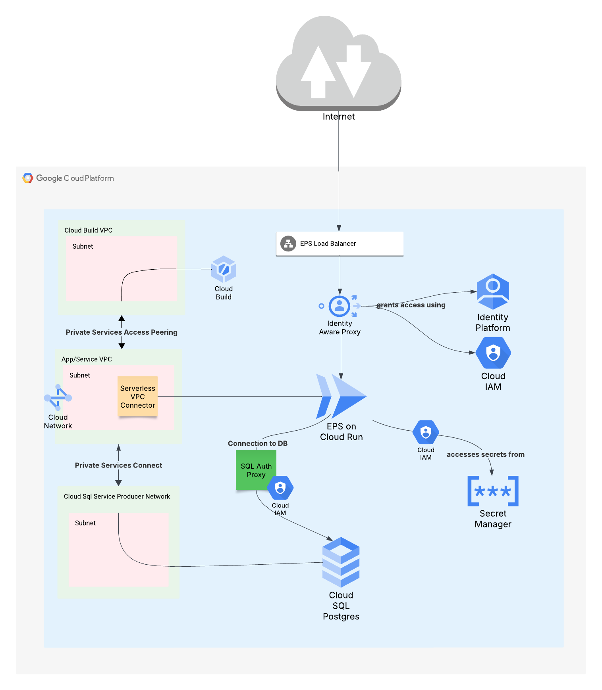
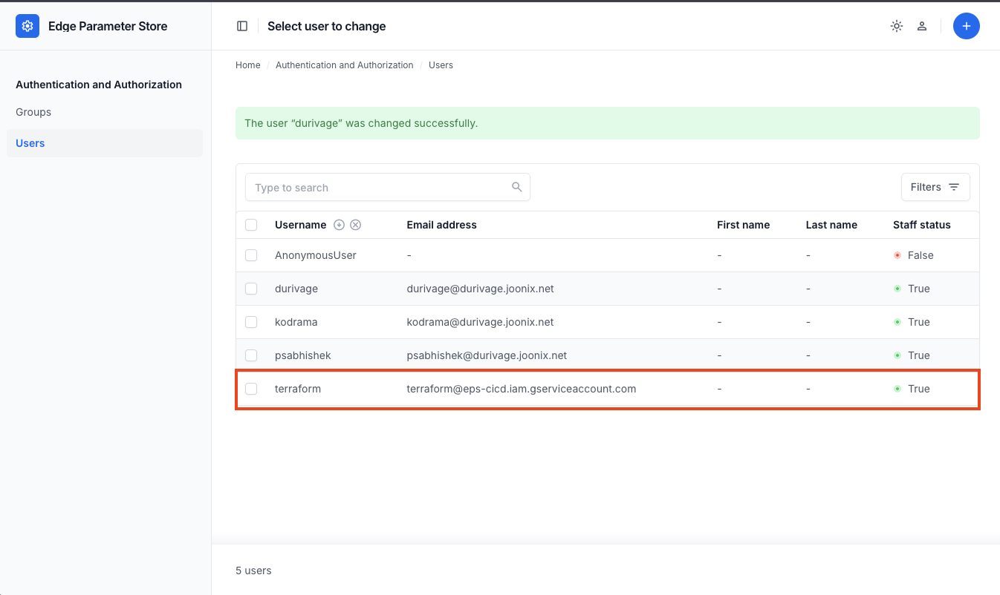
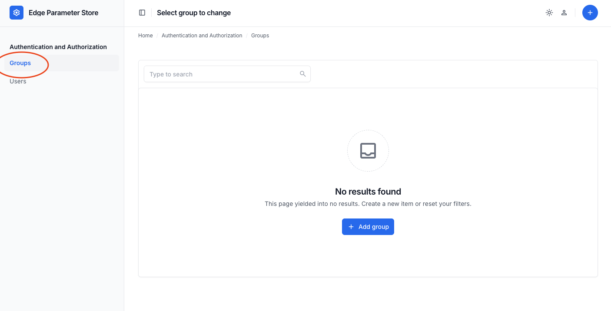
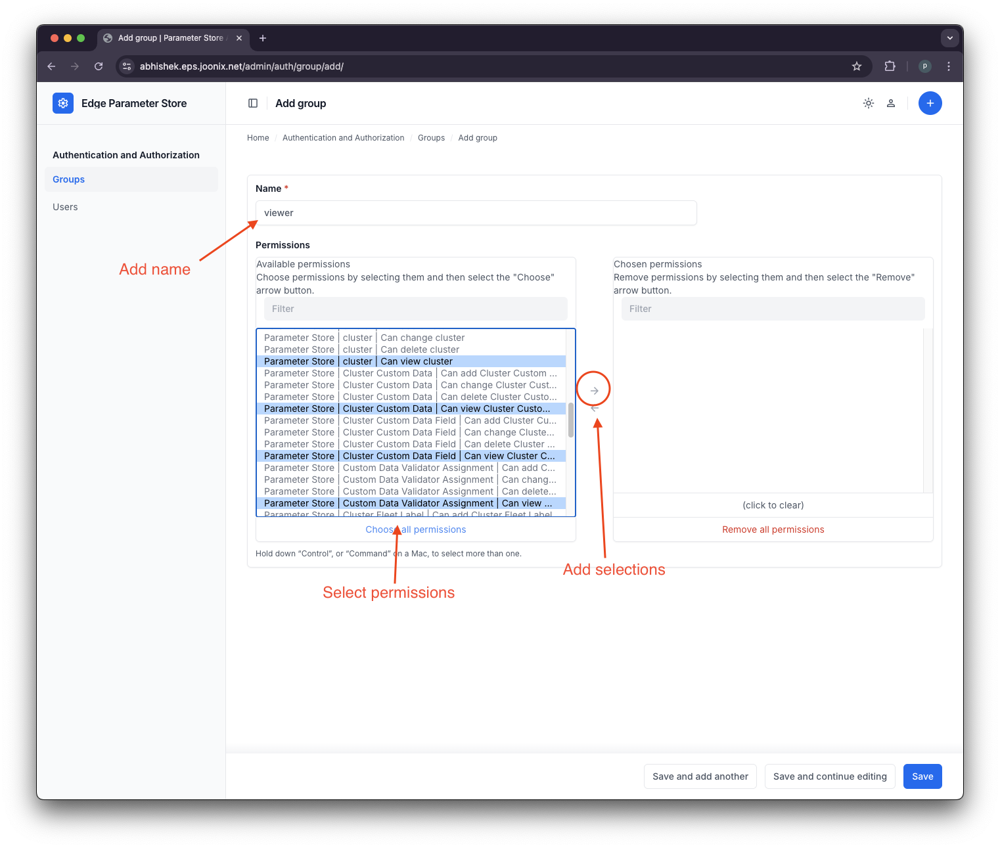
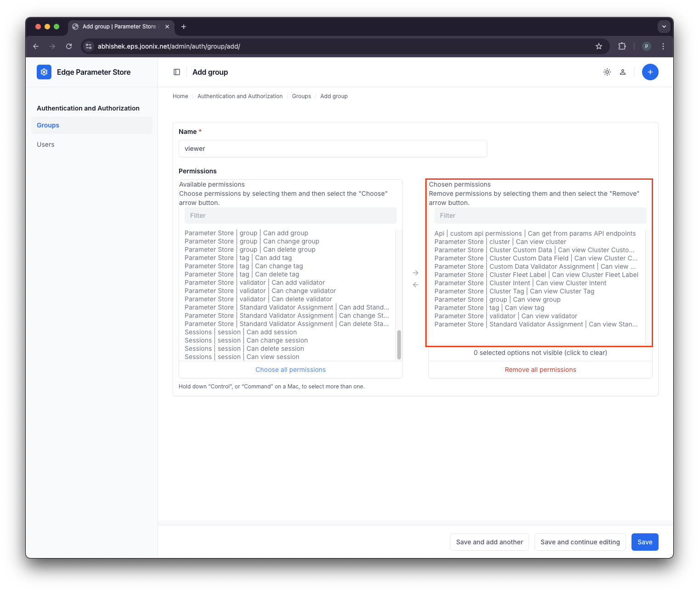
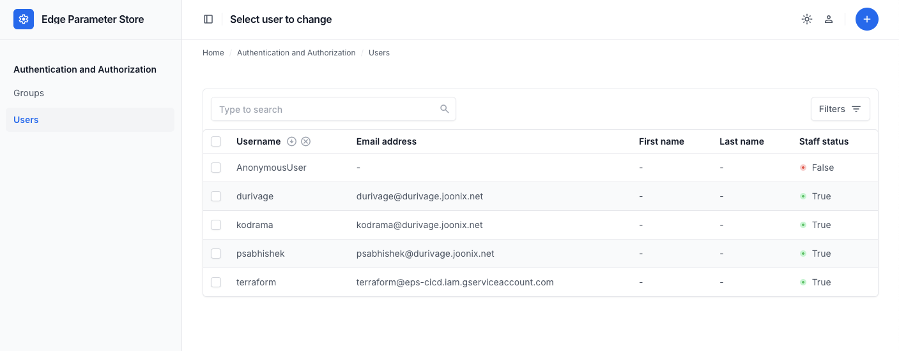
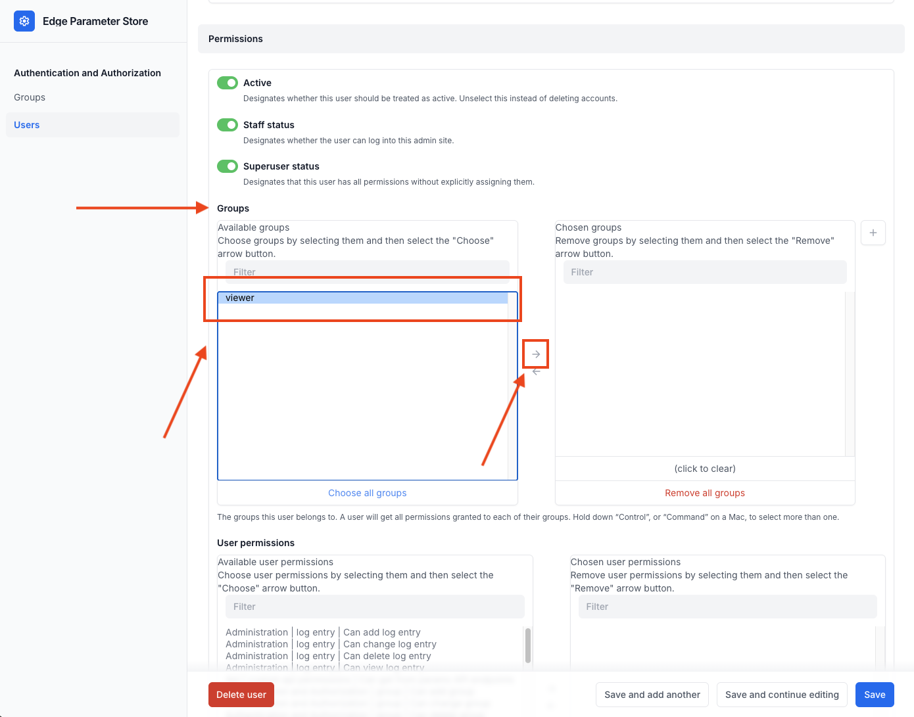
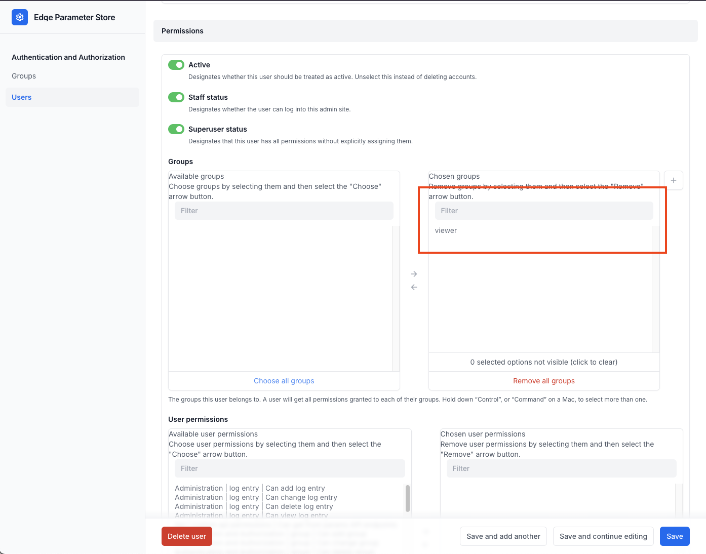
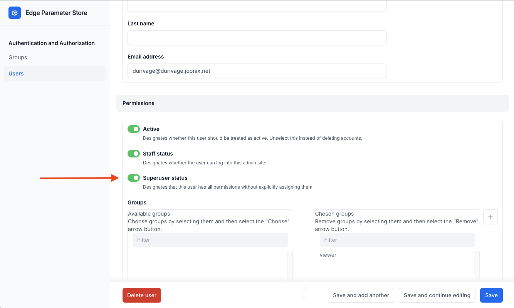

# Users, Personas, and Permissions

This document assumes a default architecture for EPS deployed to GCP using the products and services outlined in the
below architecture diagram.

## IAM Access

EPS expects to be hosted on GCP with IAP proxying its traffic. Without IAP, EPS cannot authenticate and log in users.
This is because it gets user identities from IAP via a JWT that is presented by IAP to its protected applications.

Because of the requirement to use IAP, a user may not access EPS unless they are explicitly granted IAM access
to do so.

**Grant** the user *or* group of users [IAM access](https://cloud.google.com/iap/docs/managing-access#roles) to get
through IAP to EPS. This allows users to log into the EPS application. Use the following role:

* IAP-Secured Web App User (roles/iap.httpsResourceAccessor)

**Note:** IAM access to IAP does not grant permissions inside EPS. See below for EPS permissions.

## EPS User Authentication

The JWT token that is presented to EPS by IAP is what is used to log in a user. EPS scrapes the user identity and
automatically constructs an EPS user object internally if one does not exist and logs the user into the application.

EPS uses the _user_ portion of the identity email address as a username for authentication purposes. For example, if
your Google identity is `bobsmith@example.com`, EPS will use `bobsmith` as the username.

Once the JWT is validated (i.e. is valid, not expired, issued by Google for the configured EPS audience), the user is
automatically logged into EPS.

### Service Account Authentication

Programmatic access to EPS is expected to utilize a Google service account (GSA), not a user account. Within EPS,
service
accounts are treated no differently than user accounts.

**Note:** Identity usernames for GSAs are treated no differently than user accounts. EPS interprets the username of a
user from their email address — the portion preceding the `@` of an email address. Be sure to explicitly create
and grant IAM access to GSAs with **unique names that do not collide with usernames for human users** that you grant
access to EPS. If you create a user or service account with the same username and grant both access to EPS, they will be
treated as the _same user_ within EPS and, as a result, inherit the exact same permissions.

When working with GSAs, it's important to remember that the user object within EPS is *identical* to that of a human
user so like users, GSAs...

* must have explicit [IAM access](https://cloud.google.com/iap/docs/managing-access#roles) granted to them in order to
  reach EPS via IAP
* once authenticated, present JWT tokens to EPS and are automatically logged in
* have NO permissions within EPS unless explicitly granted
* may have permissions granted to them like any other user object and may belong to groups as well
* are automatically populated in EPS as user objects within the admin portal upon first login
  

**Note**: The method by which you distinguish a GSA from a human user within the user admin panel is the email address.
A GSA will have a GSA email using a @your-project.iam.gserviceaccount.com format.

Consult the [Programmatic authentication](https://cloud.google.com/iap/docs/authentication-howto) docs for additional
information about using GSAs and IAP-protected services.

## EPS Permissions

By default, an EPS user has no permissions within EPS to perform any action or see any data (with the exception
of [superusers](#eps-superusers)).

EPS' internal permissions are managed by [Superusers](#eps-superusers) and must be granted explicitly using roles.

### Roles

Permissions within EPS are granted by roles. These roles apply to several capabilities within EPS:

1. Parameter Store Core permissions: create, read, update, and delete (CRUD) core EPS objects, such as clusters, groups,
   custom data for clusters and groups, cluster intent, fleet labels, tags, validators, and validator assignments.
2. Parameter Store API permissions: view the API
3. EPS admin permissions: to manage users, groups, object-level permissions, logs, and session information.

Roles may be added to users or groups of users.

### Recommendations

1. Start by identifying key personas. Some examples are:
    * Superusers
        * Admins of EPS
    * EPS Viewers
        * Goal: View-only in UI and API, no create/edit permissions
        * Should receive "View" only Parameter Store Roles
    * EPS Editors
        * Create and edit clusters and groups; no delete permissions
    * EPS API Viewers
        * Query the API but perform no UI actions

2. Create groups based on these personas
3. Assign relevant permissions to the group
4. Assign users to the group

### Create Groups Based on Personas

In this example, we create a "viewers" group that can see objects and query the API, but not do anything else.

1. Navigate to `/admin` within EPS
2. Go to groups
   
3. Give the group a descriptive name, select the permissions you need, and add them to the group.
    1. Note that the permissions being assigned are all "view" permissions for the "Parameter Store" app and API.
       
4. Once added, you should see the roles on the right panel indicating they are now assigned.
   
5. Save the group.

### Add users to the group

This is how a user receives the permissions associated with a group. Until this step is complete, a user has *no*
permissions within EPS. In this example, we assign the "viewers" group created in the previous section.

1. Navigate to `/admin` within EPS
2. Go to Users
   
3. Pick a user from this list to assign to a group and click their name
    1. Note: The user must exist before they may be assigned a group!
4. Scroll down to the _Groups_ section. Select the viewer group and add it.
   
5. Verify groups are added in the right multi-select box.
   
6. _Save_.

## EPS Superusers

Superusers are users which automatically receive all permissions within EPS, including:

* Full access to all parameter store objects and the API
* Full user and group admin permission, including full RBAC

EPS Superusers may:

* Create, read, update and delete *any* object within EPS, including:
    * Users and role groups
    * Clusters, cluster data, cluster groups, and all other related parameters
* Grant any access to any user or service account

*Note*: EPS Superusers may _not_ grant IAM access. The ability to grant IAM is a GCP-specific action; EPS superusers are
scoped only to the EPS application and receive no additional access outside of EPS.

### Superuser best practices

Superuser permissions should be limited to only those who truly need the ability to manage *all* objects with EPS and
those who are responsible for managing user and admin permissions within EPS. You will need at least one superuser.

### Granting Superuser Access via config

EPS by default allows superusers to be defined by config, passed in as environment parameters, to be automatically
assigned when the intended superuser logs in for the first time. This practice is codified in the example
[Terraform](../examples/terraform).

Add "usernames" following the standard username convention described in
the [EPS User Authentication](#eps-user-authentication) section in this document to
the [terraform.tfvars](../examples/terraform/terraform.tfvars) file. This is a list of strings where each string is a
username.

Alternatively, if deploying this using your own Terraform, please note the `PARAM_STORE_SUPERUSERS` environment variable
in the [run.tf](../examples/terraform/run.tf) file. EPS uses a comma-separated list of

### Granting Superuser Access

1. Navigate to `/admin` within EPS
2. Pick an existing user or create one
3. Under permissions, tick to enable the toggle for `Superuser status`
   
4. Click save
